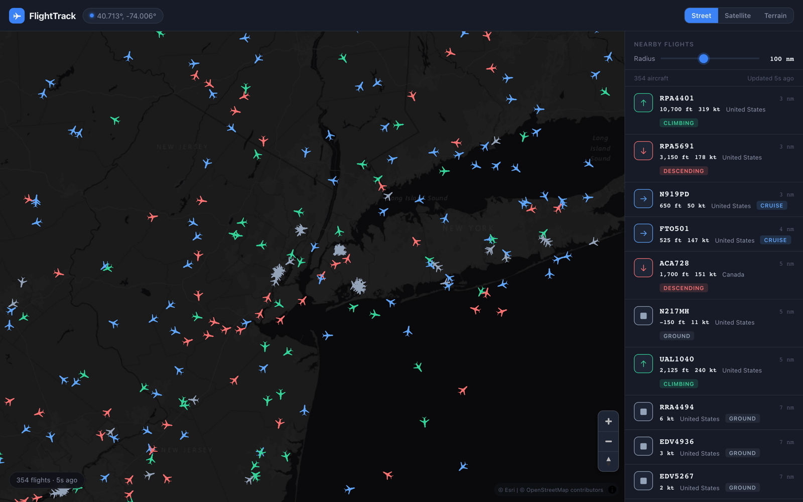
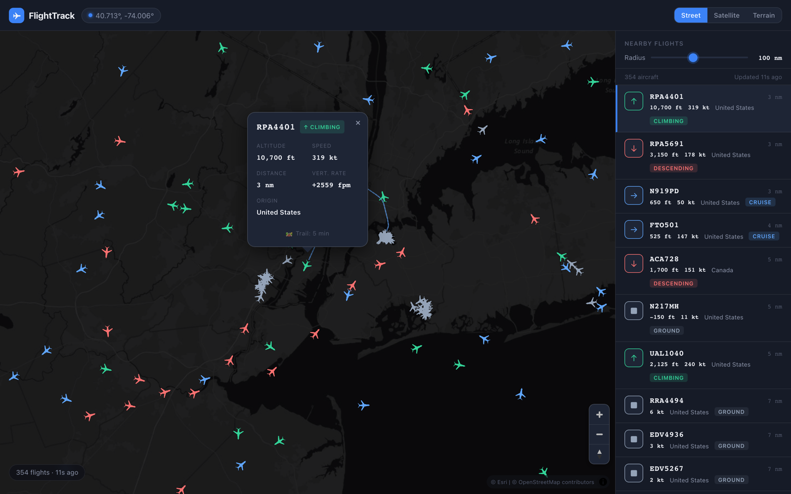
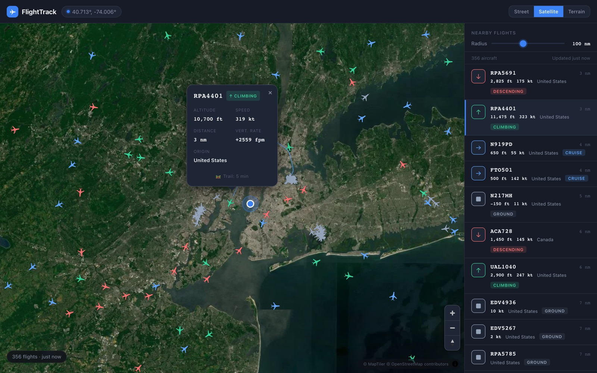
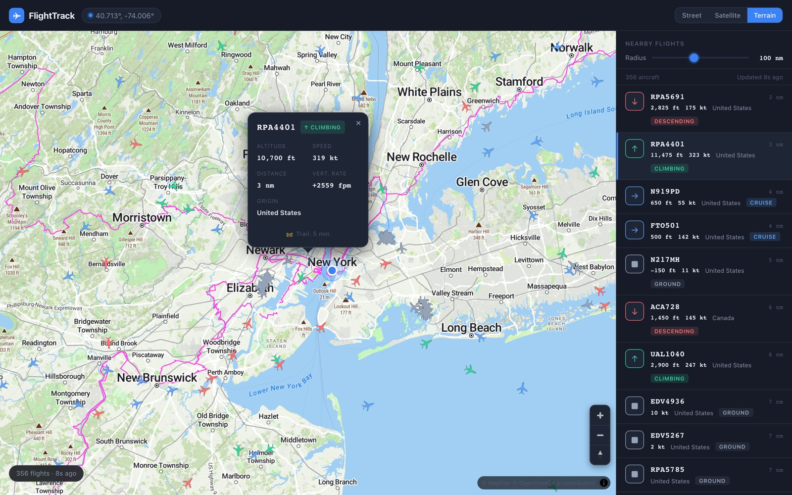
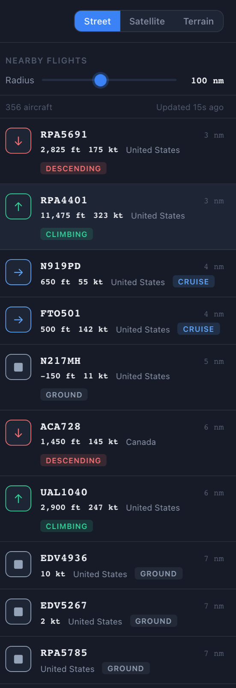
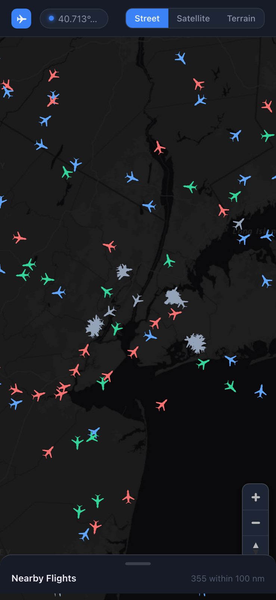

# FlightTrack

A real-time flight tracker web app built with React, TypeScript, and MapLibre GL JS. Shows live aircraft overhead based on your current location using the OpenSky Network API, with smooth position interpolation between data polls, clickable flight details, and historical flight trail overlays.



---

## Features

- **Live aircraft positions** — polls OpenSky Network every 15 seconds, sorted by distance from your location
- **Dead reckoning** — interpolates aircraft positions at 10fps between polls using heading and ground speed so icons move smoothly rather than jumping
- **Flight trails** — click any aircraft to see its recent flight path drawn on the map, auto-refreshed every 10 seconds
- **Adaptive polling** — if a dead-reckoned position diverges significantly from the most recent trail waypoint (>2 nm excess), an early poll is triggered automatically
- **Three map modes** — Street (Esri Dark Gray Canvas, no key required), Satellite, and Terrain (MapTiler, optional key)
- **Flight details popup** — callsign, altitude, speed, vertical rate, distance, and flight phase on click
- **Nearby flights panel** — scrollable sidebar (desktop) or bottom drawer (mobile) listing all flights in radius, sorted by distance
- **Radius control** — adjustable search radius from 25 to 200 nautical miles
- **Geolocation fallback chain** — GPS → IP-based city approximation → New York City default
- **Rate limit handling** — exponential backoff on 429 responses with a live countdown shown to the user
- **Page Visibility API** — polling pauses when the tab is hidden and resumes immediately on focus
- **WebGL fallback** — graceful error message if the browser lacks hardware acceleration

---

## Screenshots

### Flight details and trail

Click any aircraft — or any card in the sidebar — to open its detail popup and draw its recent track. The trail refreshes every 10 seconds as the aircraft moves.



### Map modes

Street mode needs no API key. Satellite and Terrain unlock when `VITE_MAPTILER_KEY` is set — without it, those buttons render disabled.

| Satellite | Terrain |
|---|---|
|  |  |

### Nearby flights panel and mobile layout

The sidebar lists every aircraft in radius sorted by distance, colour-coded by flight phase. Below 768 px it becomes a pull-up bottom drawer.

| Sidebar | Mobile |
|---|---|
|  |  |

---

## Tech Stack

| Layer | Choice | Notes |
|---|---|---|
| Framework | Vite + React 19 + TypeScript 6 | |
| Map | MapLibre GL JS 4 | Open-source Mapbox fork, WebGL |
| Street tiles | Esri World Dark Gray Canvas | No API key required |
| Satellite / Terrain tiles | MapTiler | Free tier, key required |
| Flight data | OpenSky Network REST API | OAuth2, 4,000 credits/day free tier |
| Unit tests | Vitest + React Testing Library | jsdom environment |
| E2E tests | Playwright | |
| Lint | ESLint + typescript-eslint | |

---

## Prerequisites

- **Node.js** 18 or later
- **npm** 9 or later (bundled with Node)
- A modern browser with WebGL support (Chrome, Firefox, Safari, Edge)

---

## Quick Start

```bash
# 1. Clone the repo
git clone https://github.com/yourname/flight-track.git
cd flight-track

# 2. Install dependencies
npm install

# 3. Copy the environment template
cp .env.example .env

# 4. (Optional) Add your API keys — see Environment Variables below

# 5. Start the dev server
npm run dev
```

Open [http://localhost:5173](http://localhost:5173). Aircraft in your area load within a few seconds.

---

## Environment Variables

All variables are optional. The app works without any keys, but authenticated access gives a much higher rate limit, and MapTiler keys unlock satellite and terrain modes.

Copy `.env.example` to `.env` in the project root:

```bash
# OpenSky Network OAuth2 credentials
# Without: anonymous access (~400 req/day, undocumented limit)
# With:    authenticated access (4,000 req/day)
# Sign up:        https://opensky-network.org/index.php?option=com_users&view=registration
# Create client:  https://opensky-network.org/index.php?option=com_users&view=profile
VITE_OPENSKY_CLIENT_ID=your_client_id
VITE_OPENSKY_CLIENT_SECRET=your_client_secret

# MapTiler API key
# Without: Satellite and Terrain buttons are disabled in the UI
# Get a free key: https://cloud.maptiler.com/account/keys/
VITE_MAPTILER_KEY=your_maptiler_key
```

> **Security note:** Never commit your `.env` file. It is already listed in `.gitignore`. Only `.env.example` (with placeholder values) belongs in version control.

---

## Architecture

### Data Flow

```
useGeolocation
  1. navigator.geolocation.getCurrentPosition()  →  exact GPS
  2. ip-api.com/json/                            →  city-level (±20 km)
  3. Hardcoded NYC { lat: 40.7128, lng: -74.006 }  →  always works
        │
        │  { lat, lng }
        ▼
  latLngToBbox(lat, lng, radiusNm)  →  BoundingBox
        │
        ▼
useOpenSky(bbox, userLat, userLng, radiusNm)
  OAuth2 POST /opensky-token  →  access_token
    cached in memory; proactively refreshed at (expires_in − 60s)
  setInterval(poll, 15_000):
    GET /opensky-api/states/all?lamin=&lamax=&lomin=&lomax=
    Deduplicate by icao24 (keep entry with highest last_contact)
    parseStateVector() → Flight[]  (null positions filtered, distance computed)
    filter by radiusNm, sort by distanceNm
    On 429: exponential backoff 2×, capped at 300s (5 min)
  Page hidden → pause | Page visible → immediate poll then resume
  setInterval(deadReckon, 100):  // 10fps
    project each airborne flight's lat/lng using speed × heading × Δt
        │
        │  Flight[]
        ▼
App.tsx  (selectedIcao, mapMode, radiusNm state)
        │
        ├──►  MapView (MapLibre GL JS / WebGL)
        │       TRAIL_LAYER   LineString, rendered below aircraft
        │       FLIGHTS_LAYER symbol icons, rotated by heading
        │       USER_LAYER    pulsing blue dot
        │
        │       On aircraft click:
        │         GET /opensky-api/tracks/all?icao24=&time=0
        │         draw trail GeoJSON, refresh every 10s
        │         if dead-reckon deviation > 2 nm → triggerPoll()
        │
        └──►  FlightPanel / MobileDrawer
                FlightCard list, radius slider
```

### CORS Proxy

OpenSky's API and OAuth2 token endpoint block browser origins. In development Vite proxies them transparently:

| Browser path | Proxied to |
|---|---|
| `POST /opensky-token` | `https://auth.opensky-network.org/auth/realms/opensky-network/protocol/openid-connect/token` |
| `GET /opensky-api/*` | `https://opensky-network.org/api/*` |

Both `server.proxy` and `preview.proxy` in `vite.config.ts` are configured. For production you need a server-side proxy — see [Deployment](#deployment).

### Dead Reckoning

Between 15-second polls, aircraft positions are projected forward at 10fps using the spherical law of cosines:

```
distanceM      = speedMs × (deltaMs / 1000)
angularDist    = distanceM / EARTH_RADIUS_M
newLat         = asin(sin(lat) × cos(d) + cos(lat) × sin(d) × cos(heading))
newLng         = lng + atan2(sin(heading) × sin(d) × cos(lat),
                             cos(d) − sin(lat) × sin(newLat))
```

Aircraft with `on_ground = true` are skipped — their position stays fixed. Dead reckoning assumes straight-and-level flight and diverges during turns or manoeuvres, which is corrected on the next poll.

### Adaptive Polling

After each trail fetch, the timestamp on the most recent waypoint determines how far the aircraft *should* have travelled at its reported speed. If the dead-reckoned current position is more than 2 nm further than that:

```
expectedNm = (flight.speedKt × waypointAgeSeconds) / 3600
actualNm   = haversineDistance(waypointLat, waypointLng, flight.lat, flight.lng)

if (actualNm − expectedNm > 2) → triggerPoll()
```

`triggerPoll` is debounced at 8 seconds — it won't fire if a poll happened recently.

---

## Project Structure

```
flight-track/
├── public/
│   └── airplane-north.svg        # Aircraft icon — MUST point north (up).
│                                 # MapLibre icon-rotate = OpenSky true_track
│                                 # (degrees clockwise from north). No offset needed.
│                                 # Verify orientation if you swap this file.
├── src/
│   ├── main.tsx                  # React root, StrictMode
│   ├── App.tsx                   # Top-level state: location, flights, selectedIcao, mapMode
│   ├── index.css                 # All styles — CSS custom properties, components, MapLibre overrides
│   ├── types.ts                  # Shared types: Flight, BoundingBox, UserLocation, TrailWaypoint, etc.
│   │
│   ├── hooks/
│   │   ├── useGeolocation.ts     # GPS → IP fallback → NYC default
│   │   └── useOpenSky.ts         # OAuth2 token, 15s poll, 429 backoff, dead reckoning, triggerPoll
│   │
│   ├── lib/
│   │   ├── deadReckon.ts         # deadReckon(lat, lng, speedMs, headingDeg, deltaMs, onGround)
│   │   ├── geo.ts                # haversineDistance, latLngToBbox, sortByDistance, format helpers
│   │   ├── opensky.ts            # parseStateVector, deriveStatus, STATUS_LABELS
│   │   └── mapStyles.ts          # MAP_STYLES per mode, hasMaptilerKey
│   │
│   ├── components/
│   │   ├── TopBar/               # Logo, location pill, Street / Satellite / Terrain toggle
│   │   ├── MapView/              # MapLibre instance, all layers, trail fetch, popup lifecycle
│   │   ├── FlightPanel/          # Desktop sidebar + mobile bottom drawer, radius slider
│   │   ├── FlightCard/           # Single flight row: icon, callsign, altitude, speed, distance
│   │   └── FlightPopup/          # index.ts — flightPopupHTML() builds the popup markup
│   │                             # as a string (MapLibre takes HTML, not React nodes)
│   │
│   └── test/                     # Unit and component tests
│       ├── setup.ts              # Loads @testing-library/jest-dom matchers
│       ├── hooks/
│       ├── lib/
│       └── components/
│
├── e2e/                          # Playwright end-to-end tests
├── docs/
│   └── images/                   # README screenshots
├── .claude/
│   └── launch.json               # Dev server config for the Claude Code preview pane
├── .env.example                  # Environment variable template
├── .env                          # Your local keys — gitignored
├── vite.config.ts                # Vite build config + Vitest config + dev/preview proxy
├── tsconfig.json
├── eslint.config.js
└── package.json
```

---

## Available Scripts

| Command | Description |
|---|---|
| `npm run dev` | Start dev server at `localhost:5173` with HMR and API proxy |
| `npm run build` | Type-check then build optimised production bundle to `dist/` |
| `npm run preview` | Serve the production build locally (proxy included) |
| `npm run lint` | Run ESLint across all source files (clean — zero errors, zero warnings) |
| `npm test` | Run unit tests in watch mode |
| `npm run test:run` | Run unit tests once (CI mode) |
| `npm run test:coverage` | Run unit tests with V8 coverage report |
| `npm run test:e2e` | Run Playwright end-to-end tests |

---

## Testing

### Test Stack

| Tool | Role |
|---|---|
| **Vitest** | Unit and component test runner (Vite-native) |
| **React Testing Library** | Component rendering and user interaction |
| **@testing-library/jest-dom** | Extra DOM matchers (`toBeInTheDocument`, `toHaveTextContent`, etc.) |
| **jsdom** | Simulated browser DOM for Node-based unit tests |
| **@vitest/coverage-v8** | Code coverage via V8 |
| **Playwright** | Full end-to-end browser automation |

### Setup

Everything is wired up already — `npm install` is all you need:

- **Vitest config** lives in the `test` block of `vite.config.ts` (jsdom environment, globals enabled, coverage via V8)
- **`src/test/setup.ts`** loads the jest-dom matchers globally
- **Test scripts** are defined in `package.json`

Test discovery is scoped to `src/test/**/*.{test,spec}.{ts,tsx}`. Playwright needs its browser binaries once:

```bash
npx playwright install
```

> **Current state:** the harness runs and the config is complete, but no test files have been written yet — `npm run test:run` passes with `--passWithNoTests`. The tables below are the intended coverage map for filling that gap.

### Running Unit Tests

```bash
# Watch mode — re-runs affected tests on save (use during development)
npm test

# Single pass — exits with code 0/1 (use in CI)
npm run test:run

# Coverage report — outputs to coverage/index.html
npm run test:coverage
```

### Running End-to-End Tests

```bash
# Install Playwright browsers (one-time setup)
npx playwright install

# Run all E2E tests headlessly
npm run test:e2e

# Run with a visible browser (useful for debugging)
npx playwright test --headed

# Run a specific spec file
npx playwright test e2e/flighttracker.spec.ts

# Open the HTML test report after a run
npx playwright show-report
```

### Unit Test Coverage Areas

Tests live in `src/test/` mirroring the `src/` structure.

| File | What to cover |
|---|---|
| `lib/geo.test.ts` | `haversineDistance` accuracy at known coordinates, `latLngToBbox` clamps to ±90/±180, `sortByDistance` ordering, all format helpers |
| `lib/deadReckon.test.ts` | Position projection for known speed/heading/Δt, `on_ground = true` returns unchanged position, zero speed/delta is a no-op, longitude wrap at the antimeridian |
| `lib/opensky.test.ts` | `parseStateVector` with null lat/lng returns `null`, valid vector produces correct `Flight` shape, `deriveStatus` boundary values (500 ft, ±1 m/s vertical rate) |
| `hooks/useGeolocation.test.ts` | GPS granted → exact position, GPS denied → IP fallback position, both fail → NYC default coordinates |
| `hooks/useOpenSky.test.ts` | Successful poll populates `flights`, 429 response triggers backoff and sets `rateLimitRetryIn`, page visibility change pauses/resumes `setInterval`, token proactive refresh scheduling |
| `components/FlightCard.test.tsx` | Renders callsign/altitude/speed/distance, `selected` prop adds highlight class, Enter key triggers `onClick` callback |
| `components/FlightPopup.test.ts` | `flightPopupHTML` output contains correct field values, trail loading state shows loading text, duration state shows minute count, HTML entities are escaped |

### E2E Test Scenarios

| Scenario | How to implement |
|---|---|
| Flights load and render on map | Mock `navigator.geolocation`, intercept `GET /opensky-api/states/all`, assert aircraft icons appear in the DOM |
| Click aircraft → popup appears | Simulate click on a map feature, assert popup element with correct callsign is visible |
| Click aircraft → trail draws | Intercept `GET /opensky-api/tracks/all`, assert the trail GeoJSON source is updated |
| Flight panel card click → map moves | Click a `FlightCard`, assert the map viewport changes or `flyTo` is called |
| Mobile bottom drawer | Set viewport to 375×812, assert drawer handle is visible and pulls up |
| Rate limit banner | Return `429` from the API intercept, assert the rate-limit countdown pill appears |
| Map mode switch | Click Satellite toggle, assert the map style URL changes |

### Mocking Strategy

**Geolocation** — stub `navigator.geolocation` with `vi.stubGlobal` in Vitest:

```ts
vi.stubGlobal('navigator', {
  geolocation: {
    getCurrentPosition: (ok: PositionCallback) =>
      ok({
        coords: { latitude: 37.77, longitude: -122.42, accuracy: 10 },
      } as GeolocationPosition),
  },
})
```

**OpenSky API** — spy on `fetch` in Vitest or use Playwright's network interception:

```ts
// Vitest
vi.spyOn(global, 'fetch').mockResolvedValue(
  new Response(JSON.stringify({ states: [/* mock state vector */] })),
)

// Playwright
await page.route('**/opensky-api/states/all**', route =>
  route.fulfill({ json: { states: [/* mock state vector */] } }),
)
```

**MapLibre GL JS** — mock the constructor in jsdom tests (WebGL is not available in Node):

```ts
vi.mock('maplibre-gl', () => ({
  default: {
    Map: vi.fn(() => ({
      on: vi.fn(),
      off: vi.fn(),
      addSource: vi.fn(),
      addLayer: vi.fn(),
      getSource: vi.fn(),
      getLayer: vi.fn(),
      isStyleLoaded: vi.fn(() => true),
      remove: vi.fn(),
    })),
    Popup: vi.fn(() => ({
      setLngLat: vi.fn().mockReturnThis(),
      setHTML: vi.fn().mockReturnThis(),
      addTo: vi.fn().mockReturnThis(),
      on: vi.fn().mockReturnThis(),
      off: vi.fn().mockReturnThis(),
      remove: vi.fn(),
    })),
  },
}))
```

---

## API Reference

### OpenSky Network

Base URL (proxied in dev): `/opensky-api`

| Endpoint | Purpose |
|---|---|
| `GET /states/all?lamin=&lamax=&lomin=&lomax=` | All aircraft in bounding box |
| `GET /tracks/all?icao24=&time=0` | Historical track for one aircraft (up to ~30 min) |

**Rate limits:**

| Auth level | Credits/day | At 15s poll interval |
|---|---|---|
| Anonymous | ~400 (estimated, undocumented) | ~1.6 hours |
| Authenticated (free tier) | 4,000 | ~16.7 hours |

Each `/states/all` call costs 1 credit regardless of aircraft count in the response.

**429 backoff schedule:**

```
First 429:  backoff = 30s   (2 × POLL_INTERVAL)
Second 429: backoff = 60s
Third 429:  backoff = 120s
Fourth+:    backoff = 240s → cap at 300s (5 min)
```

After a successful response the backoff resets to `POLL_INTERVAL`.

### OpenSky State Vector Fields

`/states/all` returns a `states` array. Each element is a positional array:

| Index | Field | Type | Description |
|---|---|---|---|
| 0 | `icao24` | string | ICAO 24-bit transponder address |
| 1 | `callsign` | string \| null | Flight callsign (trimmed) |
| 2 | `origin_country` | string | Country of registration |
| 3 | `time_position` | number \| null | Unix time of last position report |
| 4 | `last_contact` | number | Unix time of last any contact |
| 5 | `longitude` | number \| null | Decimal degrees |
| 6 | `latitude` | number \| null | Decimal degrees |
| 7 | `baro_altitude` | number \| null | Barometric altitude in metres |
| 8 | `on_ground` | boolean | True when surface position reported |
| 9 | `velocity` | number \| null | Ground speed in m/s |
| 10 | `true_track` | number \| null | Heading, degrees clockwise from north |
| 11 | `vertical_rate` | number \| null | Climb rate in m/s (positive = climbing) |

Aircraft with null `latitude` or `longitude` are excluded — they are not broadcasting ADS-B position data.

When OpenSky returns the same aircraft from multiple ground stations in one response, the entry with the highest `last_contact` (index 4) is kept and the rest are discarded.

### OpenSky Track Format

`/tracks/all` returns a `path` array where each entry is:

```
[timestampUnixSec, latitude, longitude, baroAltitudeM, trueTrackDeg, onGround]
```

Entries with null latitude or longitude are filtered out before drawing. A minimum of 2 valid waypoints is required to render a `LineString` on the map.

---

## Map Layers

Layers are added in this order (bottom to top):

| Layer ID | Type | Source | Description |
|---|---|---|---|
| `esri-dark-tiles` | raster | Esri ArcGIS CDN | Base map tiles (street mode), darkened via raster paint properties |
| `user-pulse` | circle | `user-location` | Translucent pulsing ring around the user dot |
| `user-dot` | circle | `user-location` | Solid blue user location dot |
| `flight-trail-layer` | line | `flight-trail` | Dashed blue trail for the selected aircraft |
| `flights-layer` | symbol | `flights` | Aircraft icons rotated by heading |

The aircraft icon (`public/airplane-north.svg`) **must point north** (straight up). MapLibre's `icon-rotate` reads OpenSky's `true_track` value directly (degrees clockwise from north), so no rotation offset is needed in the style expression. If you replace the icon, verify its default orientation before deploying.

---

## Flight Status Classification

Each aircraft is assigned one of four statuses from live telemetry:

| Status | Condition | Icon colour |
|---|---|---|
| `ground` | `on_ground = true` OR `altitudeFt < 500` | Grey |
| `climbing` | `verticalRateMs > +1 m/s` | Green |
| `descending` | `verticalRateMs < −1 m/s` | Red |
| `cruise` | All other airborne cases | Blue |

---

## Deployment

The Vite dev/preview proxy cannot run in a static hosting environment. You need a server-side proxy for the two OpenSky endpoints before shipping.

### Option 1 — Cloudflare Pages + Worker (recommended)

1. Create a Cloudflare Worker that accepts requests to `/opensky-token` and `/opensky-api/*`, adds your credentials, and proxies to OpenSky.
2. Store `OPENSKY_CLIENT_ID` and `OPENSKY_CLIENT_SECRET` as Worker Secrets (not in code).
3. Deploy the static build (`dist/`) to Cloudflare Pages, routing the two proxy paths through the Worker.

Free tier: 100,000 Worker requests/day. Cloudflare Pages bandwidth is unlimited on all tiers. For multi-user deployments add a 15-second cache in the Worker so all concurrent users share one OpenSky call per poll cycle.

### Option 2 — Vercel Serverless Functions

Add `api/opensky.ts` (or split into two route files) as a Vercel Edge or Serverless function that proxies to OpenSky. Store credentials as Vercel environment variables. `npm run build` output goes to `dist/`, which Vercel serves automatically.

### Option 3 — Netlify Functions

Same pattern as Vercel using Netlify Functions. Free tier covers typical personal-project traffic.

### Production Build

```bash
npm run build
# Outputs to dist/ — deploy as a static site alongside your chosen proxy
```

---

## Known Limitations

- **CORS proxy required in production** — OpenSky rejects browser origins. The Vite dev proxy covers local development only.
- **Shared API budget** — all users of a deployed instance share the same credential's 4,000 credits/day. Add server-side response caching for any multi-user deployment.
- **Dead reckoning diverges on manoeuvres** — turns, holding patterns, and steep climbs cause the icon to drift from reality until the next poll. This is acceptable for v1.
- **Trail requires ADS-B history** — military aircraft, some general aviation, and aircraft with equipment issues have no track data in OpenSky. The trail simply will not appear.
- **HTTPS required for GPS in production** — `navigator.geolocation` requires a secure context. The app falls back to IP-based location on plain HTTP.
- **Basemap providers change their terms** — street mode originally used CARTO Dark Matter, which now stamps "API KEY REQUIRED" across its free tiles. It was swapped for Esri World Dark Gray Canvas, darkened via MapLibre raster paint properties. If Esri follows suit, `STREET_STYLE` in `src/lib/mapStyles.ts` is the single place to change.
- **No test files yet** — the Vitest and Playwright harnesses are configured and runnable, but the suites described under [Testing](#testing) have not been written.

---

## License

MIT — see [LICENSE](LICENSE).
